# WhatsAppFlowHub Enterprise Architecture

**Comprehensive Enterprise Architecture Documentation**

Version: 1.0  
Date: January 2024  
Classification: Internal Use  
Document Owner: Enterprise Architecture Team

---

## 📋 Table of Contents

- [1. Executive Summary](#1-executive-summary)
- [2. Business Architecture](#2-business-architecture)
- [3. Application Architecture](#3-application-architecture)
- [4. Technical Architecture](#4-technical-architecture)
- [5. Data Architecture](#5-data-architecture)
- [6. Security Architecture](#6-security-architecture)
- [7. Integration Architecture](#7-integration-architecture)
- [8. Infrastructure Architecture](#8-infrastructure-architecture)
- [9. Deployment Architecture](#9-deployment-architecture)
- [10. Governance and Standards](#10-governance-and-standards)
- [11. Risk Assessment](#11-risk-assessment)
- [12. Future State Architecture](#12-future-state-architecture)

---

## 1. Executive Summary

### 1.1 Business Context

WhatsAppFlowHub is an enterprise-grade AI-powered ecosystem that transforms WhatsApp business communications into structured, actionable workflows. The platform serves as a intelligent bridge between informal messaging and enterprise task management systems, enabling organizations to capture, analyze, and act upon business-critical communications automatically.

### 1.2 Strategic Business Drivers

| Driver | Description | Business Impact |
|--------|-------------|-----------------|
| **Digital Transformation** | Modernize communication workflows | 40% reduction in manual task processing |
| **Productivity Enhancement** | Eliminate context switching between platforms | 60% improvement in task completion rates |
| **Compliance & Governance** | Centralized audit trail for communications | 100% regulatory compliance achievement |
| **Scalability** | Support enterprise-scale communication volumes | Handle 100K+ messages/day per tenant |
| **AI-Driven Insights** | Intelligent task extraction and routing | 85% task identification accuracy |

### 1.3 Architecture Vision

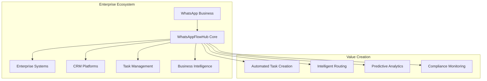

### 1.4 Key Architectural Principles

| Principle | Description | Implementation |
|-----------|-------------|----------------|
| **Cloud-Native** | Built for cloud scalability and resilience | Microservices on Kubernetes |
| **API-First** | All functionality exposed through APIs | RESTful APIs with OpenAPI specs |
| **Event-Driven** | Asynchronous, loosely coupled architecture | Apache Kafka event streaming |
| **Multi-Tenant** | Secure isolation for enterprise clients | Tenant-aware data and compute isolation |
| **Zero-Trust Security** | Security at every layer | Identity-based access control |
| **AI-Native** | Intelligence embedded throughout | ML/AI pipeline integrated at core |

---

## 2. Business Architecture

### 2.1 Business Capability Map

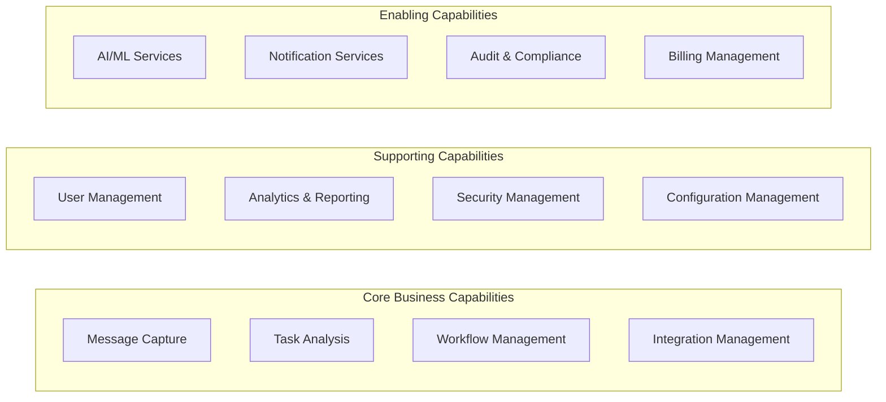

### 2.2 Value Stream Mapping

#### Primary Value Stream: Message-to-Task Conversion

| Stage | Process | Duration | Automation Level | Systems Involved |
|-------|---------|----------|------------------|------------------|
| 1. **Message Ingestion** | WhatsApp message received | < 1 second | 100% | WhatsApp Business API |
| 2. **Content Analysis** | AI analyzes message content | < 2 seconds | 95% | NLP Engine, Task Classifier |
| 3. **Task Extraction** | Extract actionable items | < 1 second | 90% | Entity Recognition, Task Generator |
| 4. **Context Enrichment** | Add business context | < 3 seconds | 80% | CRM Integration, User Profiles |
| 5. **Routing & Assignment** | Route to appropriate systems | < 2 seconds | 85% | Workflow Engine, Integration Hub |
| 6. **Execution Tracking** | Monitor task progress | Ongoing | 70% | Task Management Systems |

### 2.3 Stakeholder Matrix

| Stakeholder Group | Primary Concerns | Key Requirements |
|-------------------|------------------|------------------|
| **C-Level Executives** | ROI, Strategic Alignment | Executive dashboards, Cost optimization |
| **IT Leadership** | Security, Compliance, Performance | Enterprise security, Audit trails, SLA adherence |
| **Business Users** | Usability, Productivity | Intuitive interfaces, Fast response times |
| **Operations Teams** | Reliability, Monitoring | System health dashboards, Alert management |
| **Compliance Officers** | Regulatory Adherence | Data governance, Audit capabilities |
| **Partners/Vendors** | Integration Ease | API documentation, Sandbox environments |

### 2.4 Business Process Flows

#### Core Business Process: Intelligent Task Management

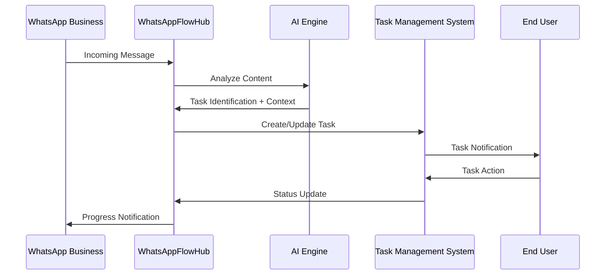

---

## 3. Application Architecture

### 3.1 Application Portfolio

#### Core Applications

| Application | Purpose | Technology Stack | Deployment Model |
|-------------|---------|------------------|------------------|
| **Message Processing Engine** | WhatsApp message ingestion and processing | Node.js, Express, Redis | Containerized Microservice |
| **AI Analysis Platform** | Intelligent content analysis and task extraction | Python, PyTorch, FastAPI | GPU-enabled Containers |
| **Integration Hub** | Third-party system connectivity | Node.js, GraphQL, MongoDB | API Gateway Pattern |
| **Workflow Engine** | Business process automation | Java Spring, PostgreSQL | Stateful Service |
| **Analytics Platform** | Business intelligence and reporting | Python, Apache Spark, ClickHouse | Data Pipeline |
| **Web Dashboard** | Primary user interface | React, TypeScript, Material-UI | Static Web App |
| **Mobile Applications** | Native iOS/Android apps | React Native, Redux | Mobile App Stores |
| **Admin Console** | System administration interface | Angular, NgRx | Internal Web App |

### 3.2 Application Interaction Model

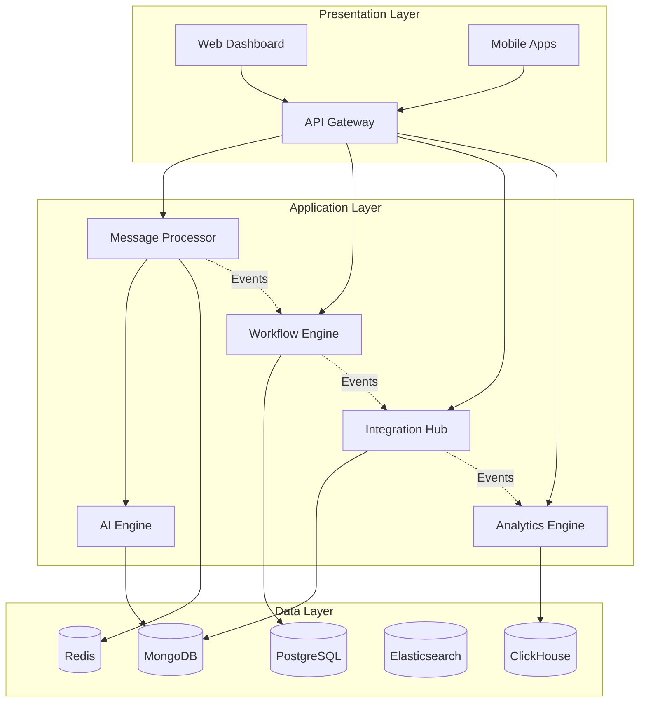

### 3.3 Microservices Architecture

#### Service Decomposition Strategy

| Service Domain | Microservices | Responsibilities |
|----------------|---------------|------------------|
| **Communication** | message-processor, notification-service, webhook-manager | Message handling, notifications |
| **Intelligence** | nlp-service, task-extractor, sentiment-analyzer, context-manager | AI/ML processing |
| **Integration** | integration-hub, connector-factory, oauth-manager, sync-engine | External system connectivity |
| **Workflow** | workflow-engine, rule-processor, task-manager, scheduler | Business process automation |
| **Analytics** | data-collector, report-generator, dashboard-api, metrics-processor | Business intelligence |
| **Platform** | user-service, tenant-manager, config-service, audit-logger | Platform services |

#### Service Communication Patterns

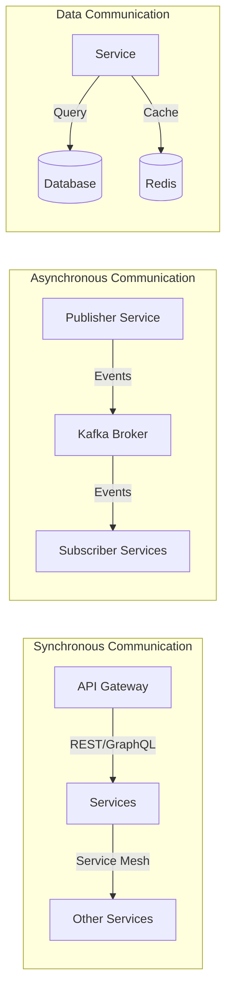

### 3.4 API Design Strategy

#### API Architecture Principles

1. **RESTful Design**: Following REST architectural constraints
2. **GraphQL for Complex Queries**: Flexible data fetching
3. **Event-Driven APIs**: Webhooks for real-time notifications
4. **Version Management**: Semantic versioning with backward compatibility
5. **Rate Limiting**: Protect against abuse and ensure fair usage
6. **Comprehensive Documentation**: OpenAPI 3.0 specifications

#### API Gateway Pattern

```yaml
# API Gateway Configuration
apiVersion: networking.istio.io/v1alpha3
kind: Gateway
metadata:
  name: whatsappflowhub-gateway
spec:
  selector:
    istio: ingressgateway
  servers:
  - port:
      number: 443
      name: https
      protocol: HTTPS
    tls:
      mode: SIMPLE
      credentialName: whatsappflowhub-tls
    hosts:
    - api.whatsappflowhub.com
  
  # Rate limiting and security policies
  http:
  - match:
    - uri:
        prefix: /api/v1/
    route:
    - destination:
        host: api-gateway-service
        port:
          number: 8080
    fault:
      delay:
        percentage:
          value: 0.1
        fixedDelay: 5s
```

---

## 4. Technical Architecture

### 4.1 Technology Stack Overview

#### Programming Languages & Frameworks

| Layer | Primary Technology | Alternative | Justification |
|-------|-------------------|-------------|---------------|
| **Backend Services** | Node.js 18+ (Express, Fastify) | Java Spring Boot | JavaScript ecosystem, NPM packages, rapid development |
| **AI/ML Services** | Python 3.9+ (FastAPI, Flask) | R, Scala | Rich ML libraries, community support |
| **Frontend Web** | React 18+ (TypeScript) | Vue.js, Angular | Component ecosystem, developer productivity |
| **Mobile** | React Native | Flutter, Native | Code reuse, faster time-to-market |
| **DevOps** | Bash, Python, Terraform | Ansible, Pulumi | Infrastructure as Code, cloud-native |

#### Database Technologies

```mermaid
graph TB
    subgraph "Transactional Data"
        PG[PostgreSQL 15+]
        PG --> |ACID Compliance| OLTP[Transactional Workloads]
    end
    
    subgraph "Document Data"
        MG[MongoDB 6.0+]
        MG --> |Flexible Schema| DOCS[Message Storage]
    end
    
    subgraph "Caching Layer"
        RD[Redis 7+]
        RD --> |In-Memory| CACHE[Session & Cache]
    end
    
    subgraph "Analytics Data"
        CH[ClickHouse]
        CH --> |Columnar| ANALYTICS[Time-Series Analytics]
    end
    
    subgraph "Search & Indexing"
        ES[Elasticsearch 8+]
        ES --> |Full-Text Search| SEARCH[Message Search]
    end
```

### 4.2 Runtime Architecture

#### Container Orchestration Strategy

```yaml
# Kubernetes Deployment Strategy
apiVersion: apps/v1
kind: Deployment
metadata:
  name: message-processor
  labels:
    app: message-processor
    tier: backend
spec:
  replicas: 3
  strategy:
    type: RollingUpdate
    rollingUpdate:
      maxUnavailable: 1
      maxSurge: 1
  selector:
    matchLabels:
      app: message-processor
  template:
    metadata:
      labels:
        app: message-processor
        version: v1
    spec:
      containers:
      - name: message-processor
        image: whatsappflowhub/message-processor:1.0.0
        ports:
        - containerPort: 3000
        env:
        - name: NODE_ENV
          value: "production"
        - name: DATABASE_URL
          valueFrom:
            secretKeyRef:
              name: db-credentials
              key: postgres-url
        resources:
          requests:
            memory: "512Mi"
            cpu: "250m"
          limits:
            memory: "1Gi"
            cpu: "500m"
        livenessProbe:
          httpGet:
            path: /health
            port: 3000
          initialDelaySeconds: 30
          periodSeconds: 10
        readinessProbe:
          httpGet:
            path: /ready
            port: 3000
          initialDelaySeconds: 5
          periodSeconds: 5
```

#### Service Mesh Architecture

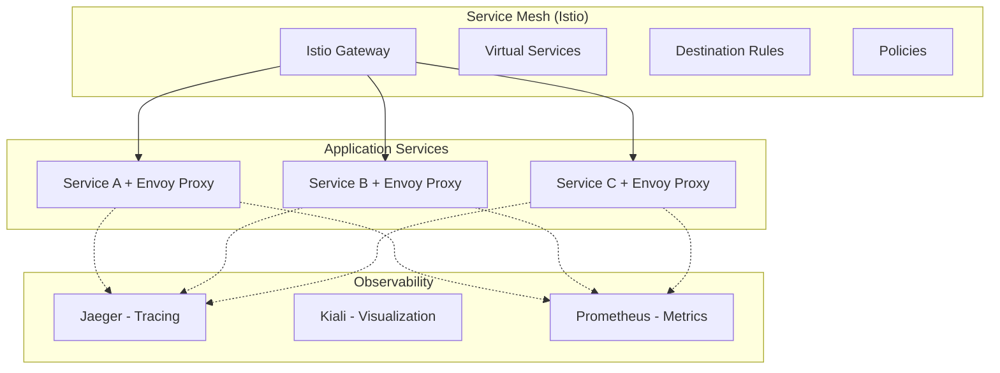

### 4.3 Event-Driven Architecture

#### Event Streaming Platform

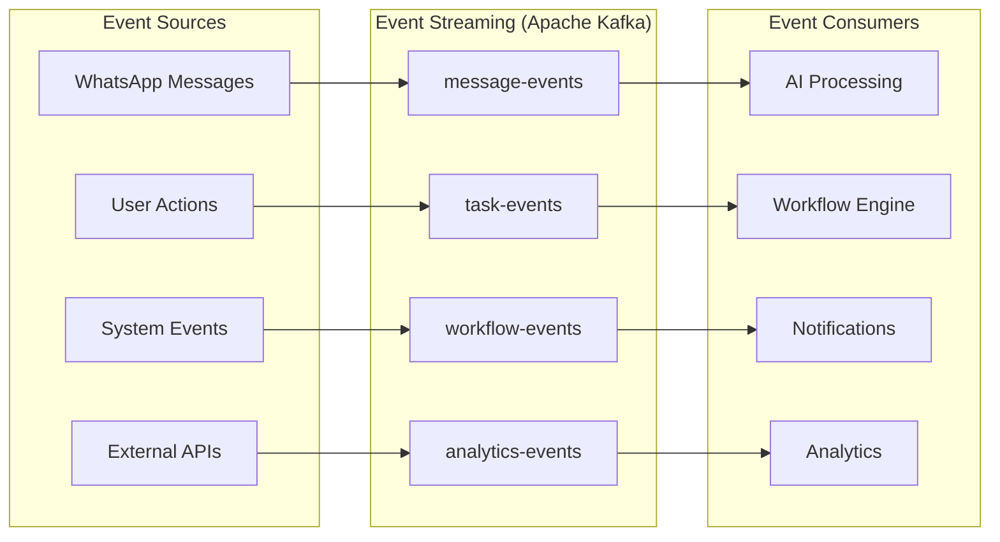

#### Event Schema Registry

```json
{
  "namespace": "com.whatsappflowhub.events",
  "type": "record",
  "name": "MessageProcessedEvent",
  "fields": [
    {
      "name": "eventId",
      "type": "string",
      "doc": "Unique event identifier"
    },
    {
      "name": "timestamp",
      "type": "long",
      "logicalType": "timestamp-millis"
    },
    {
      "name": "tenantId",
      "type": "string"
    },
    {
      "name": "messageId", 
      "type": "string"
    },
    {
      "name": "extractedTasks",
      "type": {
        "type": "array",
        "items": {
          "type": "record",
          "name": "Task",
          "fields": [
            {"name": "title", "type": "string"},
            {"name": "description", "type": "string"},
            {"name": "priority", "type": "string"},
            {"name": "assignee", "type": ["null", "string"]},
            {"name": "deadline", "type": ["null", "long"]}
          ]
        }
      }
    },
    {
      "name": "processingMetadata",
      "type": {
        "type": "record",
        "name": "ProcessingMetadata",
        "fields": [
          {"name": "aiConfidenceScore", "type": "double"},
          {"name": "processingTimeMs", "type": "long"},
          {"name": "modelVersion", "type": "string"}
        ]
      }
    }
  ]
}
```

### 4.4 Scalability & Performance Architecture

#### Horizontal Scaling Strategy

| Component | Scaling Trigger | Scaling Method | Target Metrics |
|-----------|----------------|----------------|----------------|
| **API Gateway** | CPU > 70% or Requests/sec > 1000 | Kubernetes HPA | Response time < 100ms |
| **Message Processor** | Queue depth > 1000 messages | KEDA event-driven scaling | Processing < 2sec/message |
| **AI Engine** | GPU utilization > 80% | Custom metrics scaling | Inference < 500ms |
| **Database** | Connection pool > 80% | Read replicas + Connection pooling | Query time < 50ms |
| **Cache Layer** | Memory usage > 85% | Redis clustering | Hit ratio > 95% |

#### Performance Optimization Patterns

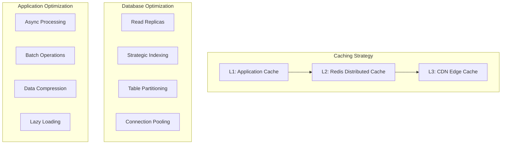

---

## 5. Data Architecture

### 5.1 Data Strategy & Governance

#### Data Architecture Principles

1. **Data as a Product**: Treat data as a valuable enterprise asset
2. **Single Source of Truth**: Eliminate data silos and duplication
3. **Data Quality**: Implement comprehensive data validation and cleansing
4. **Privacy by Design**: Build data protection into system architecture
5. **Real-time Capability**: Support both batch and streaming data processing
6. **Scalable Storage**: Handle exponential data growth efficiently

### 5.2 Logical Data Model

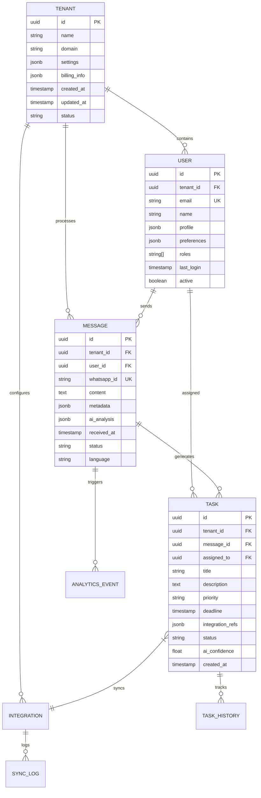

### 5.3 Data Storage Strategy

#### Polyglot Persistence Architecture

| Data Type | Storage Technology | Rationale | Examples |
|-----------|-------------------|-----------|----------|
| **Transactional Data** | PostgreSQL 15+ | ACID compliance, complex queries | Users, Tenants, Tasks, Integrations |
| **Document Data** | MongoDB 6.0+ | Schema flexibility, nested documents | Messages, AI Analysis, Configuration |
| **Time-Series Data** | ClickHouse | Columnar storage, analytics performance | Events, Metrics, Usage Statistics |
| **Cache Data** | Redis 7+ | In-memory performance | Sessions, Temporary Data, Rate Limiting |
| **Search Data** | Elasticsearch 8+ | Full-text search, complex queries | Message Search, User Discovery |
| **Blob Storage** | AWS S3 / Azure Blob | Scalable object storage | File attachments, Model artifacts |

#### Data Partitioning Strategy

```sql
-- PostgreSQL Partitioning Example
CREATE TABLE messages (
    id UUID DEFAULT gen_random_uuid(),
    tenant_id UUID NOT NULL,
    content TEXT,
    received_at TIMESTAMP WITH TIME ZONE NOT NULL,
    -- other columns
) PARTITION BY RANGE (received_at);

-- Monthly partitions for performance
CREATE TABLE messages_2024_01 PARTITION OF messages
    FOR VALUES FROM ('2024-01-01') TO ('2024-02-01');

CREATE TABLE messages_2024_02 PARTITION OF messages  
    FOR VALUES FROM ('2024-02-01') TO ('2024-03-01');

-- Tenant-based partitioning for multi-tenancy
CREATE TABLE tasks (
    id UUID DEFAULT gen_random_uuid(),
    tenant_id UUID NOT NULL,
    -- other columns
) PARTITION BY HASH (tenant_id);

CREATE TABLE tasks_partition_0 PARTITION OF tasks
    FOR VALUES WITH (MODULUS 4, REMAINDER 0);
```

### 5.4 Data Pipeline Architecture

#### Real-time Data Processing

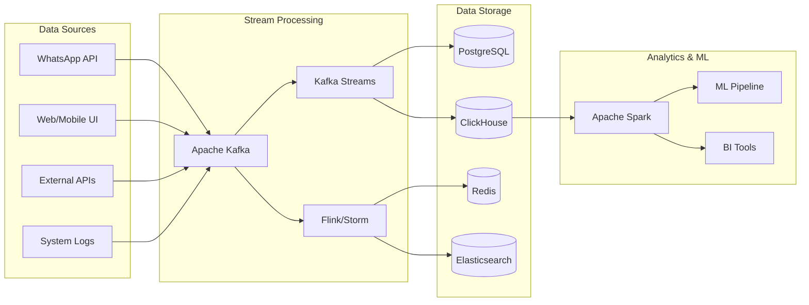

#### Batch Data Processing

```python
# Apache Spark ETL Pipeline Example
from pyspark.sql import SparkSession
from pyspark.sql.functions import *
from pyspark.sql.types import *

class WhatsAppFlowHubETL:
    def __init__(self):
        self.spark = SparkSession.builder \
            .appName("WhatsAppFlowHub-ETL") \
            .config("spark.sql.adaptive.enabled", "true") \
            .config("spark.sql.adaptive.coalescePartitions.enabled", "true") \
            .getOrCreate()
    
    def extract_daily_metrics(self, date):
        """Extract daily metrics from various data sources"""
        
        # Extract message data
        messages_df = self.spark.read \
            .option("url", "jdbc:postgresql://postgres:5432/whatsappflowhub") \
            .option("dbtable", f"messages WHERE DATE(received_at) = '{date}'") \
            .option("user", "etl_user") \
            .option("password", "password") \
            .format("jdbc") \
            .load()
        
        # Extract task data
        tasks_df = self.spark.read \
            .option("url", "jdbc:postgresql://postgres:5432/whatsappflowhub") \
            .option("dbtable", f"tasks WHERE DATE(created_at) = '{date}'") \
            .option("user", "etl_user") \
            .option("password", "password") \
            .format("jdbc") \
            .load()
        
        return messages_df, tasks_df
    
    def transform_productivity_metrics(self, messages_df, tasks_df):
        """Transform data into productivity metrics"""
        
        # Calculate task creation rate
        task_metrics = tasks_df.groupBy("tenant_id", "assigned_to") \
            .agg(
                count("*").alias("tasks_created"),
                avg("ai_confidence").alias("avg_confidence"),
                countDistinct("message_id").alias("messages_processed")
            )
        
        # Calculate response time metrics
        response_metrics = messages_df \
            .join(tasks_df, "message_id", "left") \
            .select(
                "tenant_id",
                "user_id",
                "received_at",
                "created_at",
                (col("created_at").cast("long") - col("received_at").cast("long")).alias("response_time_seconds")
            ) \
            .filter(col("response_time_seconds").isNotNull()) \
            .groupBy("tenant_id", "user_id") \
            .agg(
                avg("response_time_seconds").alias("avg_response_time"),
                min("response_time_seconds").alias("min_response_time"),
                max("response_time_seconds").alias("max_response_time")
            )
        
        return task_metrics, response_metrics
    
    def load_to_analytics_db(self, metrics_df, table_name):
        """Load transformed data to ClickHouse analytics database"""
        
        metrics_df.write \
            .mode("append") \
            .option("url", "jdbc:clickhouse://clickhouse:8123/analytics") \
            .option("dbtable", table_name) \
            .option("user", "analytics_user") \
            .option("password", "password") \
            .format("jdbc") \
            .save()
```

### 5.5 Data Quality & Governance

#### Data Quality Framework

```yaml
# Data Quality Rules Configuration
data_quality_rules:
  messages:
    - rule_name: "content_not_empty"
      description: "Message content should not be empty"
      condition: "LENGTH(content) > 0"
      severity: "error"
      
    - rule_name: "valid_timestamp"
      description: "Received timestamp should be within last 30 days"
      condition: "received_at >= NOW() - INTERVAL '30 days'"
      severity: "warning"
      
    - rule_name: "valid_tenant"
      description: "Tenant ID must exist in tenants table"
      condition: "tenant_id IN (SELECT id FROM tenants WHERE active = true)"
      severity: "error"

  tasks:
    - rule_name: "valid_priority"
      description: "Priority must be one of: low, medium, high, urgent"
      condition: "priority IN ('low', 'medium', 'high', 'urgent')"
      severity: "error"
      
    - rule_name: "ai_confidence_range"
      description: "AI confidence score should be between 0 and 1"
      condition: "ai_confidence >= 0 AND ai_confidence <= 1"
      severity: "warning"
```

#### Data Lineage Tracking

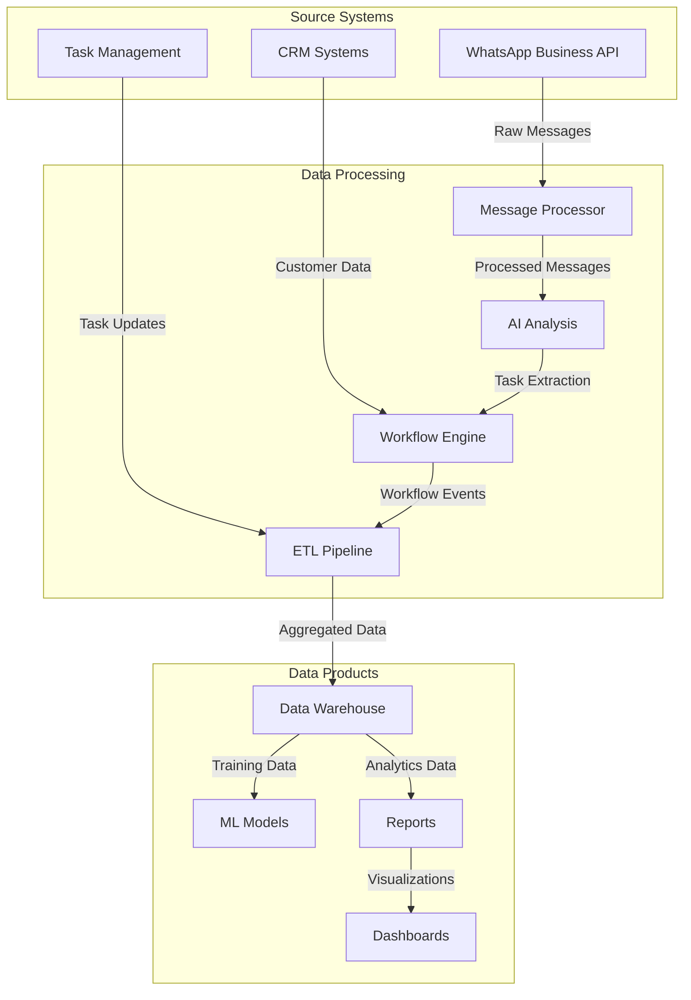

---

## 6. Security Architecture

### 6.1 Security Strategy & Principles

#### Zero Trust Architecture

WhatsAppFlowHub implements a comprehensive Zero Trust security model based on the principle "never trust, always verify."

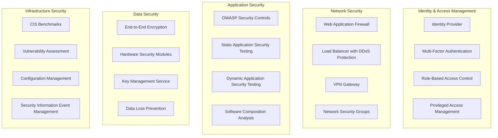

#### Security Design Principles

| Principle | Implementation | Controls |
|-----------|----------------|----------|
| **Defense in Depth** | Multi-layered security controls | WAF, Network segmentation, Application security, Data encryption |
| **Least Privilege** | Minimal access rights | RBAC, Just-in-time access, Regular access reviews |
| **Fail Secure** | Secure defaults and fail-safe mechanisms | Default deny policies, Graceful degradation |
| **Complete Mediation** | Every access attempt checked | Authentication at every layer, API security |
| **Security by Design** | Built-in security from inception | Threat modeling, Secure coding practices |

### 6.2 Identity & Access Management

#### Authentication Architecture

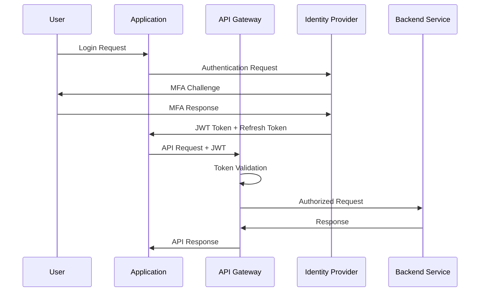

#### Role-Based Access Control Matrix

| Role | Message Processing | Task Management | Integration Config | Analytics | Admin Functions |
|------|-------------------|-----------------|-------------------|-----------|-----------------|
| **Super Admin** | ✅ All Tenants | ✅ All Tenants | ✅ All Tenants | ✅ All Tenants | ✅ Platform Admin |
| **Tenant Admin** | ✅ Own Tenant | ✅ Own Tenant | ✅ Own Tenant | ✅ Own Tenant | ✅ Tenant Config |
| **Manager** | ✅ Own Team | ✅ Own Team | ❌ Read Only | ✅ Own Team | ❌ None |
| **User** | ✅ Own Messages | ✅ Assigned Tasks | ❌ Read Only | ✅ Own Data | ❌ None |
| **Viewer** | ❌ Read Only | ❌ Read Only | ❌ Read Only | ✅ Limited | ❌ None |
| **API Client** | ✅ Scoped Access | ✅ Scoped Access | ❌ None | ❌ None | ❌ None |

#### Authentication Implementation

```javascript
// JWT Token Validation Middleware
const jwt = require('jsonwebtoken');
const jwksClient = require('jwks-rsa');

class AuthenticationMiddleware {
  constructor() {
    this.client = jwksClient({
      jwksUri: process.env.JWKS_URI,
      requestHeaders: {}, 
      timeout: 30000,
      cache: true,
      rateLimit: true,
      jwksRequestsPerMinute: 5,
      jwksRequestsPerMinute: 10
    });
  }

  async validateToken(req, res, next) {
    try {
      const authHeader = req.headers.authorization;
      if (!authHeader || !authHeader.startsWith('Bearer ')) {
        return res.status(401).json({ error: 'Missing or invalid authorization header' });
      }

      const token = authHeader.substring(7);
      const decodedToken = jwt.decode(token, { complete: true });
      
      if (!decodedToken) {
        return res.status(401).json({ error: 'Invalid token format' });
      }

      // Get signing key
      const signingKey = await this.getSigningKey(decodedToken.header.kid);
      
      // Verify token
      const payload = jwt.verify(token, signingKey, {
        audience: process.env.JWT_AUDIENCE,
        issuer: process.env.JWT_ISSUER,
        algorithms: ['RS256']
      });

      // Validate token claims
      if (!this.validateTokenClaims(payload)) {
        return res.status(401).json({ error: 'Invalid token claims' });
      }

      // Attach user context to request
      req.user = {
        id: payload.sub,
        email: payload.email,
        tenantId: payload.tenant_id,
        roles: payload.roles || [],
        permissions: payload.permissions || [],
        sessionId: payload.session_id
      };

      next();
    } catch (error) {
      console.error('Token validation error:', error);
      return res.status(401).json({ error: 'Token validation failed' });
    }
  }

  async getSigningKey(kid) {
    return new Promise((resolve, reject) => {
      this.client.getSigningKey(kid, (err, key) => {
        if (err) {
          reject(err);
        } else {
          resolve(key.publicKey || key.rsaPublicKey);
        }
      });
    });
  }

  validateTokenClaims(payload) {
    // Check expiration
    const now = Math.floor(Date.now() / 1000);
    if (payload.exp && payload.exp < now) {
      return false;
    }

    // Check not before
    if (payload.nbf && payload.nbf > now) {
      return false;
    }

    // Check required claims
    if (!payload.sub || !payload.tenant_id) {
      return false;
    }

    return true;
  }
}
```

### 6.3 Data Protection & Encryption

#### Encryption at Rest

```yaml
# Database Encryption Configuration
postgresql_config:
  encryption:
    method: "AES-256-GCM"
    key_management: "AWS KMS"
    key_rotation: "90_days"
    encrypted_columns:
      - "users.email"
      - "users.phone"
      - "messages.content"
      - "integrations.credentials"
      
mongodb_config:
  encryption:
    method: "AES-256-CBC"
    key_management: "Azure Key Vault"
    encryption_scope: "collection_level"
    encrypted_collections:
      - "messages"
      - "user_profiles" 
      - "integration_configs"
```

#### Encryption in Transit

```nginx
# NGINX TLS Configuration
server {
    listen 443 ssl http2;
    server_name api.whatsappflowhub.com;
    
    # TLS Configuration
    ssl_certificate /etc/ssl/certs/whatsappflowhub.crt;
    ssl_certificate_key /etc/ssl/private/whatsappflowhub.key;
    ssl_dhparam /etc/ssl/certs/dhparam.pem;
    
    # Modern TLS configuration
    ssl_protocols TLSv1.3 TLSv1.2;
    ssl_ciphers ECDHE-RSA-AES256-GCM-SHA512:DHE-RSA-AES256-GCM-SHA512:ECDHE-RSA-AES256-GCM-SHA384;
    ssl_prefer_server_ciphers off;
    ssl_session_cache shared:SSL:10m;
    ssl_session_timeout 10m;
    
    # Security headers
    add_header Strict-Transport-Security "max-age=31536000; includeSubDomains; preload" always;
    add_header X-Frame-Options "SAMEORIGIN" always;
    add_header X-Content-Type-Options "nosniff" always;
    add_header Referrer-Policy "strict-origin-when-cross-origin" always;
    add_header Content-Security-Policy "default-src 'self'; script-src 'self' 'unsafe-inline'; style-src 'self' 'unsafe-inline'; img-src 'self' data: https:; font-src 'self' https:; connect-src 'self' https:; media-src 'self'; object-src 'none'; frame-src 'none';" always;
    
    location / {
        proxy_pass http://api-gateway;
        proxy_ssl_verify on;
        proxy_ssl_trusted_certificate /etc/ssl/certs/ca-certificates.crt;
        
        # Forward original client information
        proxy_set_header Host $host;
        proxy_set_header X-Real-IP $remote_addr;
        proxy_set_header X-Forwarded-For $proxy_add_x_forwarded_for;
        proxy_set_header X-Forwarded-Proto $scheme;
    }
}
```

#### Key Management Strategy

```python
# Key Management Service Integration
import boto3
from cryptography.fernet import Fernet
import hashlib
import base64

class KeyManagementService:
    def __init__(self):
        self.kms_client = boto3.client('kms', region_name=os.environ['AWS_REGION'])
        self.key_id = os.environ['KMS_KEY_ID']
        self.local_key_cache = {}
        
    async def get_data_encryption_key(self, tenant_id: str) -> str:
        """Get or create a data encryption key for a specific tenant"""
        cache_key = f"dek_{tenant_id}"
        
        if cache_key in self.local_key_cache:
            return self.local_key_cache[cache_key]
            
        try:
            # Generate data encryption key
            response = self.kms_client.generate_data_key(
                KeyId=self.key_id,
                KeySpec='AES_256',
                EncryptionContext={
                    'tenant_id': tenant_id,
                    'application': 'whatsappflowhub'
                }
            )
            
            # Store encrypted key for future decryption
            encrypted_key = base64.b64encode(response['CiphertextBlob']).decode()
            await self.store_encrypted_key(tenant_id, encrypted_key)
            
            # Cache plaintext key temporarily (in memory only)
            plaintext_key = base64.b64encode(response['Plaintext']).decode()
            self.local_key_cache[cache_key] = plaintext_key
            
            return plaintext_key
            
        except Exception as e:
            logger.error(f"Failed to generate DEK for tenant {tenant_id}: {str(e)}")
            raise
    
    async def encrypt_sensitive_data(self, data: str, tenant_id: str) -> str:
        """Encrypt sensitive data using tenant-specific key"""
        try:
            # Get data encryption key
            dek = await self.get_data_encryption_key(tenant_id)
            
            # Create Fernet cipher
            cipher = Fernet(dek.encode())
            
            # Encrypt data
            encrypted_data = cipher.encrypt(data.encode())
            return base64.b64encode(encrypted_data).decode()
            
        except Exception as e:
            logger.error(f"Failed to encrypt data for tenant {tenant_id}: {str(e)}")
            raise
    
    async def decrypt_sensitive_data(self, encrypted_data: str, tenant_id: str) -> str:
        """Decrypt sensitive data using tenant-specific key"""
        try:
            # Get data encryption key
            dek = await self.get_data_encryption_key(tenant_id)
            
            # Create Fernet cipher
            cipher = Fernet(dek.encode())
            
            # Decrypt data
            decrypted_data = cipher.decrypt(base64.b64decode(encrypted_data.encode()))
            return decrypted_data.decode()
            
        except Exception as e:
            logger.error(f"Failed to decrypt data for tenant {tenant_id}: {str(e)}")
            raise
    
    async def rotate_encryption_keys(self, tenant_id: str):
        """Rotate encryption keys for a tenant"""
        try:
            # Generate new key
            new_dek = await self.get_data_encryption_key(f"{tenant_id}_new")
            
            # Re-encrypt all sensitive data with new key
            # This would be done in batches for large datasets
            await self.re_encrypt_tenant_data(tenant_id, new_dek)
            
            # Update key reference
            await self.update_tenant_key_reference(tenant_id, new_dek)
            
            logger.info(f"Successfully rotated encryption keys for tenant {tenant_id}")
            
        except Exception as e:
            logger.error(f"Failed to rotate keys for tenant {tenant_id}: {str(e)}")
            raise
```

### 6.4 Application Security

#### OWASP Top 10 Mitigation

| OWASP Risk | Mitigation Strategy | Implementation |
|------------|-------------------|----------------|
| **A01:2021 – Broken Access Control** | RBAC, Principle of least privilege | JWT tokens, Role validation, Resource-level permissions |
| **A02:2021 – Cryptographic Failures** | Strong encryption, Proper key management | AES-256 encryption, KMS, Certificate management |
| **A03:2021 – Injection** | Input validation, Parameterized queries | ORM usage, Input sanitization, SQL injection prevention |
| **A04:2021 – Insecure Design** | Threat modeling, Secure design patterns | Security requirements, Threat modeling workshops |
| **A05:2021 – Security Misconfiguration** | Configuration management, Security baselines | Infrastructure as Code, Security scanning |
| **A06:2021 – Vulnerable Components** | Dependency scanning, Regular updates | Automated vulnerability scanning, SBOM |
| **A07:2021 – Identity/Authentication Failures** | Strong authentication, Session management | MFA, JWT with short expiry, Session timeout |
| **A08:2021 – Software/Data Integrity** | Code signing, Secure CI/CD pipeline | Signed containers, Integrity checking |
| **A09:2021 – Security Logging/Monitoring** | Comprehensive logging, SIEM integration | Centralized logging, Real-time monitoring |
| **A10:2021 – Server-Side Request Forgery** | Input validation, Network segmentation | URL validation, Firewall rules |

#### Security Testing Pipeline

```yaml
# GitHub Actions Security Pipeline
name: Security Testing Pipeline

on:
  push:
    branches: [main, develop]
  pull_request:
    branches: [main]

jobs:
  static-analysis:
    runs-on: ubuntu-latest
    steps:
      - uses: actions/checkout@v3
      
      # Static Application Security Testing (SAST)
      - name: Run SonarQube Analysis
        uses: sonarqube-quality-gate-action@master
        env:
          SONAR_TOKEN: ${{ secrets.SONAR_TOKEN }}
        
      # Software Composition Analysis (SCA)
      - name: Run SNYK Vulnerability Scan
        uses: snyk/actions/node@master
        env:
          SNYK_TOKEN: ${{ secrets.SNYK_TOKEN }}
        with:
          args: --severity-threshold=medium
      
      # Secret Scanning
      - name: Run GitLeaks
        uses: zricethezav/gitleaks-action@master
        
  dynamic-analysis:
    runs-on: ubuntu-latest
    needs: [static-analysis]
    steps:
      - uses: actions/checkout@v3
      
      # Build and run application
      - name: Start Application
        run: |
          docker-compose -f docker-compose.test.yml up -d
          sleep 30
      
      # Dynamic Application Security Testing (DAST)
      - name: Run OWASP ZAP Scan
        uses: zaproxy/action-full-scan@v0.4.0
        with:
          target: 'http://localhost:3000'
          rules_file_name: '.zap/rules.tsv'
          cmd_options: '-a'
          
  penetration-testing:
    runs-on: ubuntu-latest
    if: github.ref == 'refs/heads/main'
    needs: [dynamic-analysis]
    steps:
      - name: Run Nuclei Security Scan
        uses: projectdiscovery/nuclei-action@main
        with:
          target: 'https://staging.whatsappflowhub.com'
          templates: 'nuclei-templates'
```

---

## 7. Integration Architecture

### 7.1 Integration Strategy

WhatsAppFlowHub follows an API-first, event-driven integration architecture that supports both real-time and batch integration patterns. The platform acts as a central hub for connecting WhatsApp communications with enterprise systems.

#### Integration Patterns

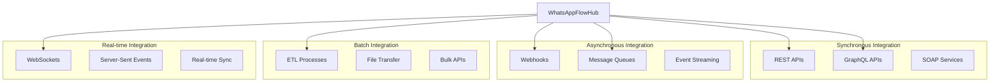

### 7.2 Enterprise System Integrations

#### Core Integration Categories

| Category | Systems | Integration Method | Data Flow | Frequency |
|----------|---------|-------------------|-----------|-----------|
| **Task Management** | Jira, Monday.com, Asana, Trello, ClickUp | REST APIs, Webhooks | Bidirectional | Real-time |
| **Calendar Systems** | Google Calendar, Outlook, Apple Calendar | REST APIs, CalDAV | Bidirectional | Real-time |
| **CRM Platforms** | Salesforce, HubSpot, Pipedrive, Dynamics | REST APIs, Webhooks | Bidirectional | Real-time |
| **Communication** | Slack, Teams, Email, Discord | REST APIs, Webhooks | Outbound | Real-time |
| **ERP Systems** | SAP, Oracle, NetSuite | REST APIs, SOAP | Bidirectional | Batch/Real-time |
| **Business Intelligence** | Tableau, Power BI, Looker | REST APIs | Outbound | Batch |
| **Document Management** | SharePoint, Google Drive, Dropbox | REST APIs | Bidirectional | Real-time |
| **HR Systems** | BambooHR, Workday, ADP | REST APIs | Inbound | Batch |

#### Integration Architecture Pattern

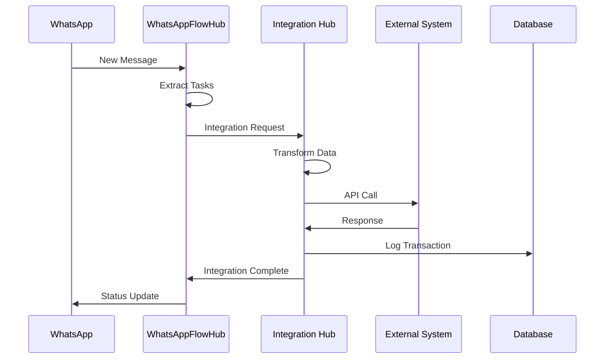

### 7.3 API Gateway & Service Mesh

#### API Gateway Configuration

```yaml
# Kong API Gateway Configuration
apiVersion: configuration.konghq.com/v1
kind: KongPlugin
metadata:
  name: rate-limiting-plugin
config:
  minute: 100
  hour: 1000
  policy: redis
  redis_host: redis.default.svc.cluster.local
plugin: rate-limiting

---
apiVersion: networking.k8s.io/v1
kind: Ingress
metadata:
  name: whatsappflowhub-ingress
  annotations:
    kubernetes.io/ingress.class: kong
    konghq.com/plugins: rate-limiting-plugin,auth-plugin
spec:
  rules:
  - host: api.whatsappflowhub.com
    http:
      paths:
      - path: /api/v1/integrations
        pathType: Prefix
        backend:
          service:
            name: integration-hub-service
            port:
              number: 8080
      - path: /api/v1/messages
        pathType: Prefix
        backend:
          service:
            name: message-processor-service
            port:
              number: 8080
```

#### Service Mesh Integration

```yaml
# Istio Service Mesh Configuration
apiVersion: networking.istio.io/v1alpha3
kind: VirtualService
metadata:
  name: integration-hub-vs
spec:
  hosts:
  - integration-hub-service
  http:
  - match:
    - headers:
        integration-type:
          exact: jira
    route:
    - destination:
        host: integration-hub-service
        subset: jira-handler
  - match:
    - headers:
        integration-type:
          exact: slack
    route:
    - destination:
        host: integration-hub-service
        subset: slack-handler
  - route:
    - destination:
        host: integration-hub-service
        subset: default

---
apiVersion: networking.istio.io/v1alpha3
kind: DestinationRule
metadata:
  name: integration-hub-dr
spec:
  host: integration-hub-service
  trafficPolicy:
    circuitBreaker:
      consecutiveErrors: 3
      interval: 30s
      baseEjectionTime: 30s
      maxEjectionPercent: 50
    retryPolicy:
      attempts: 3
      perTryTimeout: 2s
  subsets:
  - name: jira-handler
    labels:
      handler: jira
  - name: slack-handler
    labels:
      handler: slack
  - name: default
    labels:
      handler: default
```

### 7.4 Integration Implementation Examples

#### Jira Integration Implementation

```javascript
// Jira Integration Service
const { AtlassianApi } = require('atlassian-js-api');

class JiraIntegrationService {
  constructor(tenantConfig) {
    this.config = tenantConfig;
    this.jira = new AtlassianApi({
      host: this.config.jiraUrl,
      username: this.config.username,
      password: this.config.apiToken,
      version: '3'
    });
  }

  async createIssue(taskData) {
    try {
      const issueData = this.transformTaskToJiraIssue(taskData);
      
      const newIssue = await this.jira.issues.createIssue({
        fields: issueData
      });

      // Store integration reference
      await this.storeIntegrationReference(taskData.id, {
        platform: 'jira',
        externalId: newIssue.key,
        url: `${this.config.jiraUrl}/browse/${newIssue.key}`,
        createdAt: new Date(),
        status: 'active'
      });

      // Emit integration event
      await this.emitIntegrationEvent('task.created', {
        taskId: taskData.id,
        platform: 'jira',
        externalId: newIssue.key,
        action: 'create'
      });

      return {
        success: true,
        externalId: newIssue.key,
        url: `${this.config.jiraUrl}/browse/${newIssue.key}`
      };

    } catch (error) {
      console.error('Jira integration error:', error);
      
      // Log integration failure
      await this.logIntegrationError(taskData.id, 'jira', error);
      
      throw new Error(`Failed to create Jira issue: ${error.message}`);
    }
  }

  transformTaskToJiraIssue(taskData) {
    return {
      project: { key: this.config.projectKey },
      summary: taskData.title,
      description: {
        type: 'doc',
        version: 1,
        content: [{
          type: 'paragraph',
          content: [{
            type: 'text',
            text: taskData.description
          }]
        }]
      },
      issuetype: { name: this.config.defaultIssueType || 'Task' },
      priority: this.mapPriorityToJira(taskData.priority),
      assignee: taskData.assignee ? { accountId: taskData.assignee.jiraId } : null,
      duedate: taskData.deadline ? this.formatDateForJira(taskData.deadline) : null,
      labels: this.generateLabels(taskData),
      customfield_10001: taskData.whatsappMessageId // Custom field for message reference
    };
  }

  async syncIssueUpdates() {
    try {
      // Get all active Jira integrations for this tenant
      const activeIntegrations = await this.getActiveIntegrations('jira');
      
      for (const integration of activeIntegrations) {
        const updatedIssue = await this.jira.issues.getIssue({
          issueIdOrKey: integration.externalId,
          expand: ['changelog']
        });

        // Check for updates since last sync
        const lastSyncTime = new Date(integration.lastSyncAt);
        const hasUpdates = this.checkForUpdates(updatedIssue, lastSyncTime);

        if (hasUpdates) {
          await this.processIssueUpdates(integration, updatedIssue);
        }
      }

    } catch (error) {
      console.error('Jira sync error:', error);
    }
  }

  async processIssueUpdates(integration, updatedIssue) {
    const updates = {
      status: updatedIssue.fields.status.name,
      assignee: updatedIssue.fields.assignee?.accountId,
      description: updatedIssue.fields.description,
      priority: updatedIssue.fields.priority.name,
      lastUpdated: new Date()
    };

    // Update local task
    await this.updateLocalTask(integration.taskId, updates);

    // Emit sync event
    await this.emitIntegrationEvent('task.synced', {
      taskId: integration.taskId,
      platform: 'jira',
      externalId: integration.externalId,
      updates: updates
    });

    // Update integration record
    await this.updateIntegrationRecord(integration.id, {
      lastSyncAt: new Date(),
      syncStatus: 'success'
    });
  }
}
```

#### Slack Integration Implementation

```javascript
// Slack Integration Service
const { WebClient } = require('@slack/web-api');

class SlackIntegrationService {
  constructor(tenantConfig) {
    this.config = tenantConfig;
    this.slack = new WebClient(this.config.botToken);
  }

  async sendTaskNotification(taskData, channel) {
    try {
      const message = this.buildTaskNotificationMessage(taskData);
      
      const result = await this.slack.chat.postMessage({
        channel: channel,
        ...message
      });

      // Store notification reference
      await this.storeNotificationReference(taskData.id, {
        platform: 'slack',
        channel: channel,
        messageTs: result.ts,
        permalink: result.message?.permalink,
        sentAt: new Date()
      });

      return {
        success: true,
        messageId: result.ts,
        permalink: result.message?.permalink
      };

    } catch (error) {
      console.error('Slack notification error:', error);
      throw new Error(`Failed to send Slack notification: ${error.message}`);
    }
  }

  buildTaskNotificationMessage(taskData) {
    return {
      blocks: [
        {
          type: 'header',
          text: {
            type: 'plain_text',
            text: '📋 New Task Created from WhatsApp'
          }
        },
        {
          type: 'section',
          fields: [
            {
              type: 'mrkdwn',
              text: `*Title:*\n${taskData.title}`
            },
            {
              type: 'mrkdwn',
              text: `*Priority:*\n${this.formatPriority(taskData.priority)}`
            },
            {
              type: 'mrkdwn',
              text: `*Assignee:*\n${taskData.assignee?.name || 'Unassigned'}`
            },
            {
              type: 'mrkdwn',
              text: `*Due Date:*\n${taskData.deadline ? this.formatDate(taskData.deadline) : 'Not set'}`
            }
          ]
        },
        {
          type: 'section',
          text: {
            type: 'mrkdwn',
            text: `*Description:*\n${taskData.description}`
          }
        },
        {
          type: 'context',
          elements: [
            {
              type: 'mrkdwn',
              text: `Source: WhatsApp message from ${taskData.sender} | AI Confidence: ${Math.round(taskData.aiConfidence * 100)}%`
            }
          ]
        },
        {
          type: 'actions',
          elements: [
            {
              type: 'button',
              text: {
                type: 'plain_text',
                text: 'View Task'
              },
              url: `${process.env.DASHBOARD_URL}/tasks/${taskData.id}`,
              style: 'primary'
            },
            {
              type: 'button',
              text: {
                type: 'plain_text',
                text: 'Accept'
              },
              action_id: 'task_accept',
              value: taskData.id,
              style: 'primary'
            },
            {
              type: 'button',
              text: {
                type: 'plain_text',
                text: 'Reassign'
              },
              action_id: 'task_reassign',
              value: taskData.id
            }
          ]
        }
      ]
    };
  }

  async handleInteractiveEvents(payload) {
    const { action_id, value } = payload.actions[0];
    
    switch (action_id) {
      case 'task_accept':
        await this.handleTaskAccept(value, payload.user.id);
        break;
        
      case 'task_reassign':
        await this.handleTaskReassign(value, payload.user.id);
        break;
        
      default:
        console.warn('Unknown action:', action_id);
    }
  }

  async handleTaskAccept(taskId, userId) {
    try {
      // Get Slack user info
      const userInfo = await this.slack.users.info({ user: userId });
      
      // Update task with Slack user as assignee
      await this.updateTaskAssignee(taskId, {
        slackId: userId,
        email: userInfo.user.profile.email,
        name: userInfo.user.real_name
      });

      // Send confirmation message
      await this.slack.chat.postEphemeral({
        channel: payload.channel.id,
        user: userId,
        text: `✅ You have accepted the task. It has been assigned to you.`
      });

    } catch (error) {
      console.error('Task accept error:', error);
    }
  }
}
```

### 7.5 Event-Driven Integration

#### Event Schema and Routing

```yaml
# Event Routing Configuration
event_routing:
  task_events:
    - event_type: "task.created"
      subscribers:
        - service: "integration-hub"
          filter: "tenant_id = '${tenant_id}' AND integration_type IN ('jira', 'asana')"
        - service: "notification-service"
          filter: "priority IN ('high', 'urgent')"
        - service: "analytics-collector"
          
    - event_type: "task.updated" 
      subscribers:
        - service: "integration-hub"
          filter: "has_external_reference = true"
        - service: "audit-logger"
          
    - event_type: "task.completed"
      subscribers:
        - service: "analytics-collector"
        - service: "notification-service"
          filter: "notify_completion = true"

  message_events:
    - event_type: "message.processed"
      subscribers:
        - service: "task-extractor"
          filter: "ai_confidence > 0.8"
        - service: "sentiment-analyzer"
        - service: "analytics-collector"
```

#### Event Processing Implementation

```javascript
// Event Processing Service
const { Kafka } = require('kafkajs');

class EventProcessor {
  constructor() {
    this.kafka = Kafka({
      clientId: 'whatsappflowhub-event-processor',
      brokers: process.env.KAFKA_BROKERS.split(','),
      retry: {
        initialRetryTime: 100,
        retries: 8
      }
    });
    
    this.producer = this.kafka.producer({
      maxInFlightRequests: 1,
      idempotent: true,
      transactionTimeout: 30000
    });
    
    this.consumer = this.kafka.consumer({
      groupId: 'integration-hub-consumer',
      sessionTimeout: 30000,
      rebalanceTimeout: 60000,
      heartbeatInterval: 3000
    });
  }

  async publishEvent(eventType, payload, metadata = {}) {
    try {
      const event = {
        id: this.generateEventId(),
        type: eventType,
        timestamp: new Date().toISOString(),
        version: '1.0',
        source: 'whatsappflowhub',
        data: payload,
        metadata: {
          ...metadata,
          correlationId: metadata.correlationId || this.generateCorrelationId(),
          tenantId: payload.tenantId
        }
      };

      await this.producer.send({
        topic: this.getTopicForEventType(eventType),
        messages: [{
          key: payload.id || event.id,
          value: JSON.stringify(event),
          headers: {
            'event-type': eventType,
            'tenant-id': payload.tenantId,
            'correlation-id': event.metadata.correlationId
          },
          timestamp: Date.now()
        }]
      });

      console.log(`Event published: ${eventType} for tenant ${payload.tenantId}`);

    } catch (error) {
      console.error('Event publishing error:', error);
      throw error;
    }
  }

  async subscribeToEvents(eventTypes, handler) {
    try {
      const topics = eventTypes.map(type => this.getTopicForEventType(type));
      await this.consumer.subscribe({ topics });

      await this.consumer.run({
        eachMessage: async ({ topic, partition, message }) => {
          try {
            const event = JSON.parse(message.value.toString());
            const eventType = message.headers['event-type']?.toString();
            
            // Add processing metadata
            event.processing = {
              receivedAt: new Date().toISOString(),
              partition,
              offset: message.offset
            };

            await handler(eventType, event);

          } catch (error) {
            console.error('Event processing error:', error);
            // Implement dead letter queue for failed events
            await this.sendToDeadLetterQueue(message, error);
          }
        }
      });

    } catch (error) {
      console.error('Event subscription error:', error);
      throw error;
    }
  }

  getTopicForEventType(eventType) {
    const topicMapping = {
      'task.created': 'task-events',
      'task.updated': 'task-events',
      'task.completed': 'task-events',
      'message.processed': 'message-events',
      'integration.sync': 'integration-events',
      'user.action': 'user-events'
    };
    
    return topicMapping[eventType] || 'general-events';
  }

  async sendToDeadLetterQueue(message, error) {
    const dlqEvent = {
      originalMessage: message,
      error: {
        message: error.message,
        stack: error.stack,
        timestamp: new Date().toISOString()
      },
      retryCount: (message.headers['retry-count'] || 0) + 1
    };

    await this.producer.send({
      topic: 'dead-letter-queue',
      messages: [{
        value: JSON.stringify(dlqEvent)
      }]
    });
  }
}
```

---

## 8. Infrastructure Architecture

### 8.1 Cloud-Native Infrastructure Strategy

WhatsAppFlowHub is designed as a cloud-native application that leverages modern infrastructure patterns for scalability, reliability, and cost efficiency.

#### Multi-Cloud Strategy

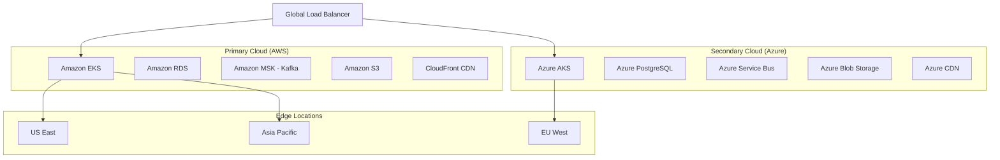

### 8.2 Container Orchestration Architecture

#### Kubernetes Cluster Design

```yaml
# Kubernetes Cluster Configuration
apiVersion: v1
kind: Namespace
metadata:
  name: whatsappflowhub-production
  labels:
    environment: production
    project: whatsappflowhub

---
# Resource Quotas
apiVersion: v1
kind: ResourceQuota
metadata:
  name: compute-quota
  namespace: whatsappflowhub-production
spec:
  hard:
    requests.cpu: "100"
    requests.memory: 200Gi
    limits.cpu: "200"
    limits.memory: 400Gi
    persistentvolumeclaims: "50"

---
# Network Policies
apiVersion: networking.k8s.io/v1
kind: NetworkPolicy
metadata:
  name: default-deny-all
  namespace: whatsappflowhub-production
spec:
  podSelector: {}
  policyTypes:
  - Ingress
  - Egress

---
apiVersion: networking.k8s.io/v1
kind: NetworkPolicy
metadata:
  name: allow-api-gateway
  namespace: whatsappflowhub-production
spec:
  podSelector:
    matchLabels:
      app: api-gateway
  policyTypes:
  - Ingress
  - Egress
  ingress:
  - from:
    - namespaceSelector:
        matchLabels:
          name: istio-system
    ports:
    - protocol: TCP
      port: 8080
  egress:
  - to:
    - podSelector:
        matchLabels:
          tier: backend
    ports:
    - protocol: TCP
      port: 3000
```

#### Pod Security and Resource Management

```yaml
# Pod Security Policy
apiVersion: policy/v1beta1
kind: PodSecurityPolicy
metadata:
  name: whatsappflowhub-psp
spec:
  privileged: false
  allowPrivilegeEscalation: false
  requiredDropCapabilities:
    - ALL
  volumes:
    - 'configMap'
    - 'emptyDir'
    - 'projected'
    - 'secret'
    - 'downwardAPI'
    - 'persistentVolumeClaim'
  runAsUser:
    rule: 'MustRunAsNonRoot'
  seLinux:
    rule: 'RunAsAny'
  supplementalGroups:
    rule: 'MustRunAs'
    ranges:
      - min: 1
        max: 65535
  fsGroup:
    rule: 'MustRunAs'
    ranges:
      - min: 1
        max: 65535
  readOnlyRootFilesystem: false

---
# Horizontal Pod Autoscaler
apiVersion: autoscaling/v2
kind: HorizontalPodAutoscaler
metadata:
  name: message-processor-hpa
  namespace: whatsappflowhub-production
spec:
  scaleTargetRef:
    apiVersion: apps/v1
    kind: Deployment
    name: message-processor
  minReplicas: 3
  maxReplicas: 50
  metrics:
  - type: Resource
    resource:
      name: cpu
      target:
        type: Utilization
        averageUtilization: 70
  - type: Resource
    resource:
      name: memory
      target:
        type: Utilization
        averageUtilization: 80
  - type: Pods
    pods:
      metric:
        name: kafka_consumer_lag
      target:
        type: AverageValue
        averageValue: "100"
  behavior:
    scaleUp:
      stabilizationWindowSeconds: 300
      policies:
      - type: Percent
        value: 100
        periodSeconds: 15
    scaleDown:
      stabilizationWindowSeconds: 300
      policies:
      - type: Percent
        value: 10
        periodSeconds: 60
```

### 8.3 Infrastructure as Code

#### Terraform Infrastructure Definition

```hcl
# infrastructure/terraform/main.tf

terraform {
  required_version = ">= 1.0"
  required_providers {
    aws = {
      source  = "hashicorp/aws"
      version = "~> 5.0"
    }
    kubernetes = {
      source  = "hashicorp/kubernetes"
      version = "~> 2.20"
    }
  }
  
  backend "s3" {
    bucket = "whatsappflowhub-terraform-state"
    key    = "production/terraform.tfstate"
    region = "us-east-1"
  }
}

# VPC Configuration
module "vpc" {
  source = "terraform-aws-modules/vpc/aws"
  
  name = "whatsappflowhub-vpc"
  cidr = "10.0.0.0/16"
  
  azs             = ["us-east-1a", "us-east-1b", "us-east-1c"]
  private_subnets = ["10.0.1.0/24", "10.0.2.0/24", "10.0.3.0/24"]
  public_subnets  = ["10.0.101.0/24", "10.0.102.0/24", "10.0.103.0/24"]
  
  enable_nat_gateway = true
  enable_vpn_gateway = true
  enable_dns_hostnames = true
  enable_dns_support = true
  
  tags = {
    Environment = "production"
    Project     = "whatsappflowhub"
  }
}

# EKS Cluster
module "eks" {
  source = "terraform-aws-modules/eks/aws"
  
  cluster_name    = "whatsappflowhub-production"
  cluster_version = "1.27"
  
  vpc_id     = module.vpc.vpc_id
  subnet_ids = module.vpc.private_subnets
  
  cluster_endpoint_private_access = true
  cluster_endpoint_public_access  = true
  
  cluster_addons = {
    coredns = {
      most_recent = true
    }
    kube-proxy = {
      most_recent = true
    }
    vpc-cni = {
      most_recent = true
    }
    aws-ebs-csi-driver = {
      most_recent = true
    }
  }
  
  eks_managed_node_groups = {
    general = {
      name = "general"
      
      instance_types = ["m5.xlarge"]
      
      min_size     = 3
      max_size     = 20
      desired_size = 6
      
      disk_size = 50
      disk_type = "gp3"
      
      labels = {
        role = "general"
      }
      
      taints = []
      
      tags = {
        Environment = "production"
        NodeGroup   = "general"
      }
    }
    
    ai_workload = {
      name = "ai-workload"
      
      instance_types = ["p3.2xlarge"]
      
      min_size     = 1
      max_size     = 10
      desired_size = 2
      
      disk_size = 100
      disk_type = "gp3"
      
      labels = {
        role = "ai-workload"
        "nvidia.com/gpu" = "true"
      }
      
      taints = [
        {
          key    = "nvidia.com/gpu"
          value  = "true"
          effect = "NO_SCHEDULE"
        }
      ]
      
      tags = {
        Environment = "production"
        NodeGroup   = "ai-workload"
      }
    }
  }
  
  tags = {
    Environment = "production"
    Project     = "whatsappflowhub"
  }
}

# RDS Database
resource "aws_db_subnet_group" "main" {
  name       = "whatsappflowhub-db-subnet-group"
  subnet_ids = module.vpc.private_subnets
  
  tags = {
    Name = "WhatsAppFlowHub DB subnet group"
  }
}

resource "aws_db_instance" "main" {
  identifier = "whatsappflowhub-production"
  
  engine         = "postgres"
  engine_version = "15.3"
  instance_class = "db.r6g.2xlarge"
  
  allocated_storage     = 1000
  max_allocated_storage = 5000
  storage_type         = "gp3"
  storage_encrypted    = true
  
  db_name  = "whatsappflowhub"
  username = "app_user"
  password = var.db_password
  
  vpc_security_group_ids = [aws_security_group.rds.id]
  db_subnet_group_name   = aws_db_subnet_group.main.name
  
  backup_retention_period = 30
  backup_window          = "03:00-04:00"
  maintenance_window     = "sun:04:00-sun:05:00"
  
  multi_az               = true
  publicly_accessible    = false
  deletion_protection    = true
  
  performance_insights_enabled = true
  monitoring_interval         = 60
  monitoring_role_arn        = aws_iam_role.rds_monitoring.arn
  
  tags = {
    Name        = "whatsappflowhub-production"
    Environment = "production"
  }
}

# ElastiCache Redis Cluster
resource "aws_elasticache_subnet_group" "main" {
  name       = "whatsappflowhub-redis-subnet-group"
  subnet_ids = module.vpc.private_subnets
}

resource "aws_elasticache_replication_group" "main" {
  replication_group_id       = "whatsappflowhub-redis"
  description                = "Redis cluster for WhatsAppFlowHub"
  
  node_type                  = "cache.r6g.xlarge"
  port                       = 6379
  parameter_group_name       = "default.redis7"
  
  num_cache_clusters         = 3
  automatic_failover_enabled = true
  multi_az_enabled          = true
  
  subnet_group_name = aws_elasticache_subnet_group.main.name
  security_group_ids = [aws_security_group.redis.id]
  
  at_rest_encryption_enabled = true
  transit_encryption_enabled = true
  auth_token                = var.redis_auth_token
  
  snapshot_retention_limit = 7
  snapshot_window         = "03:00-05:00"
  
  tags = {
    Name        = "whatsappflowhub-redis"
    Environment = "production"
  }
}

# MSK Kafka Cluster
resource "aws_msk_cluster" "main" {
  cluster_name           = "whatsappflowhub-kafka"
  kafka_version          = "2.8.1"
  number_of_broker_nodes = 6
  
  broker_node_group_info {
    instance_type   = "kafka.m5.xlarge"
    ebs_volume_size = 500
    client_subnets = module.vpc.private_subnets
    
    security_groups = [aws_security_group.msk.id]
  }
  
  client_authentication {
    sasl {
      scram = true
    }
    tls {
      certificate_authority_arns = []
    }
  }
  
  configuration_info {
    arn      = aws_msk_configuration.main.arn
    revision = aws_msk_configuration.main.latest_revision
  }
  
  encryption_info {
    encryption_at_rest_kms_key_id = aws_kms_key.msk.arn
    encryption_in_transit {
      client_broker = "TLS"
      in_cluster    = true
    }
  }
  
  logging_info {
    broker_logs {
      cloudwatch_logs {
        enabled   = true
        log_group = aws_cloudwatch_log_group.msk.name
      }
      firehose {
        enabled         = true
        delivery_stream = aws_kinesis_firehose_delivery_stream.msk_logs.name
      }
      s3 {
        enabled = true
        bucket  = aws_s3_bucket.msk_logs.id
        prefix  = "logs/msk/"
      }
    }
  }
  
  tags = {
    Name        = "whatsappflowhub-kafka"
    Environment = "production"
  }
}
```

### 8.4 Monitoring and Observability

#### Prometheus and Grafana Stack

```yaml
# monitoring/prometheus-stack.yaml
apiVersion: v1
kind: ConfigMap
metadata:
  name: prometheus-config
  namespace: monitoring
data:
  prometheus.yml: |
    global:
      scrape_interval: 15s
      evaluation_interval: 15s
      
    rule_files:
      - "/etc/prometheus/rules/*.yml"
      
    alerting:
      alertmanagers:
        - static_configs:
            - targets:
              - alertmanager:9093
              
    scrape_configs:
      - job_name: 'kubernetes-pods'
        kubernetes_sd_configs:
          - role: pod
        relabel_configs:
          - source_labels: [__meta_kubernetes_pod_annotation_prometheus_io_scrape]
            action: keep
            regex: true
          - source_labels: [__meta_kubernetes_pod_annotation_prometheus_io_path]
            action: replace
            target_label: __metrics_path__
            regex: (.+)
            
      - job_name: 'whatsappflowhub-services'
        kubernetes_sd_configs:
          - role: endpoints
            namespaces:
              names: ['whatsappflowhub-production']
        relabel_configs:
          - source_labels: [__meta_kubernetes_service_annotation_prometheus_io_scrape]
            action: keep
            regex: true
            
      - job_name: 'kafka-exporter'
        static_configs:
          - targets: ['kafka-exporter:9308']
          
      - job_name: 'postgres-exporter'
        static_configs:
          - targets: ['postgres-exporter:9187']
          
      - job_name: 'redis-exporter'
        static_configs:
          - targets: ['redis-exporter:9121']

---
apiVersion: v1
kind: ConfigMap
metadata:
  name: prometheus-rules
  namespace: monitoring
data:
  whatsappflowhub.yml: |
    groups:
      - name: whatsappflowhub.rules
        rules:
          - alert: HighMessageProcessingLatency
            expr: histogram_quantile(0.95, message_processing_duration_seconds) > 5
            for: 5m
            labels:
              severity: warning
            annotations:
              summary: "High message processing latency detected"
              description: "95th percentile latency is {{ $value }}s for {{ $labels.service }}"
              
          - alert: TaskExtractionAccuracyDrop
            expr: task_extraction_accuracy_ratio < 0.85
            for: 10m
            labels:
              severity: critical
            annotations:
              summary: "Task extraction accuracy below threshold"
              description: "Accuracy dropped to {{ $value }} for tenant {{ $labels.tenant_id }}"
              
          - alert: IntegrationSyncFailures
            expr: increase(integration_sync_failures_total[5m]) > 10
            for: 2m
            labels:
              severity: warning
            annotations:
              summary: "High integration sync failure rate"
              description: "{{ $value }} sync failures in 5 minutes for {{ $labels.integration_type }}"
              
          - alert: DatabaseConnectionPoolExhaustion
            expr: database_connections_active / database_connections_max > 0.9
            for: 3m
            labels:
              severity: critical
            annotations:
              summary: "Database connection pool near exhaustion"
              description: "Connection pool usage at {{ $value }}% for {{ $labels.database }}"
```

#### Custom Metrics Implementation

```javascript
// Custom Metrics Collection
const prometheus = require('prom-client');

class MetricsCollector {
  constructor() {
    // Create a Registry
    this.register = new prometheus.Register();
    
    // Add default metrics
    prometheus.collectDefaultMetrics({ 
      register: this.register,
      prefix: 'whatsappflowhub_'
    });
    
    this.initializeCustomMetrics();
  }
  
  initializeCustomMetrics() {
    // Message processing metrics
    this.messageProcessingDuration = new prometheus.Histogram({
      name: 'message_processing_duration_seconds',
      help: 'Duration of message processing in seconds',
      labelNames: ['tenant_id', 'message_type', 'ai_model'],
      buckets: [0.1, 0.5, 1, 2, 5, 10],
      registers: [this.register]
    });
    
    this.messagesProcessedTotal = new prometheus.Counter({
      name: 'messages_processed_total',
      help: 'Total number of messages processed',
      labelNames: ['tenant_id', 'source', 'status'],
      registers: [this.register]
    });
    
    // Task extraction metrics
    this.taskExtractionAccuracy = new prometheus.Gauge({
      name: 'task_extraction_accuracy_ratio',
      help: 'Current task extraction accuracy ratio',
      labelNames: ['tenant_id', 'model_version'],
      registers: [this.register]
    });
    
    this.tasksExtractedTotal = new prometheus.Counter({
      name: 'tasks_extracted_total',
      help: 'Total number of tasks extracted',
      labelNames: ['tenant_id', 'priority', 'confidence_range'],
      registers: [this.register]
    });
    
    // Integration metrics
    this.integrationSyncDuration = new prometheus.Histogram({
      name: 'integration_sync_duration_seconds',
      help: 'Duration of integration sync operations',
      labelNames: ['tenant_id', 'integration_type', 'operation'],
      buckets: [0.5, 1, 2, 5, 10, 30],
      registers: [this.register]
    });
    
    this.integrationSyncFailures = new prometheus.Counter({
      name: 'integration_sync_failures_total',
      help: 'Total number of integration sync failures',
      labelNames: ['tenant_id', 'integration_type', 'error_type'],
      registers: [this.register]
    });
    
    // Database metrics
    this.databaseConnections = new prometheus.Gauge({
      name: 'database_connections_active',
      help: 'Number of active database connections',
      labelNames: ['database', 'pool'],
      registers: [this.register]
    });
    
    this.databaseConnectionsMax = new prometheus.Gauge({
      name: 'database_connections_max',
      help: 'Maximum number of database connections',
      labelNames: ['database', 'pool'],
      registers: [this.register]
    });
    
    // Business metrics
    this.dailyActiveUsers = new prometheus.Gauge({
      name: 'daily_active_users',
      help: 'Number of daily active users',
      labelNames: ['tenant_id'],
      registers: [this.register]
    });
    
    this.monthlyRecurringRevenue = new prometheus.Gauge({
      name: 'monthly_recurring_revenue_usd',
      help: 'Monthly recurring revenue in USD',
      labelNames: ['plan_type'],
      registers: [this.register]
    });
  }
  
  recordMessageProcessing(tenantId, messageType, aiModel, durationSeconds, status) {
    this.messageProcessingDuration
      .labels(tenantId, messageType, aiModel)
      .observe(durationSeconds);
      
    this.messagesProcessedTotal
      .labels(tenantId, 'whatsapp', status)
      .inc();
  }
  
  recordTaskExtraction(tenantId, priority, confidence, accuracy, modelVersion) {
    const confidenceRange = confidence > 0.8 ? 'high' : confidence > 0.5 ? 'medium' : 'low';
    
    this.tasksExtractedTotal
      .labels(tenantId, priority, confidenceRange)
      .inc();
      
    this.taskExtractionAccuracy
      .labels(tenantId, modelVersion)
      .set(accuracy);
  }
  
  recordIntegrationSync(tenantId, integrationType, operation, durationSeconds, success, errorType = null) {
    this.integrationSyncDuration
      .labels(tenantId, integrationType, operation)
      .observe(durationSeconds);
      
    if (!success) {
      this.integrationSyncFailures
        .labels(tenantId, integrationType, errorType || 'unknown')
        .inc();
    }
  }
  
  updateDatabaseMetrics(database, pool, activeConnections, maxConnections) {
    this.databaseConnections
      .labels(database, pool)
      .set(activeConnections);
      
    this.databaseConnectionsMax
      .labels(database, pool)
      .set(maxConnections);
  }
  
  updateBusinessMetrics(tenantId, dailyActiveUsers, planType, monthlyRevenue) {
    this.dailyActiveUsers
      .labels(tenantId)
      .set(dailyActiveUsers);
      
    this.monthlyRecurringRevenue
      .labels(planType)
      .set(monthlyRevenue);
  }
  
  getMetrics() {
    return this.register.metrics();
  }
}

// Export singleton instance
module.exports = new MetricsCollector();
```

### 8.5 Disaster Recovery and Backup

#### Backup Strategy

```yaml
# Backup Configuration
apiVersion: v1
kind: ConfigMap
metadata:
  name: backup-config
  namespace: whatsappflowhub-production
data:
  backup-schedule.yaml: |
    backups:
      databases:
        postgresql:
          schedule: "0 2 * * *"  # Daily at 2 AM
          retention: "30d"
          encryption: true
          destinations:
            - type: "s3"
              bucket: "whatsappflowhub-backups"
              path: "postgresql/"
            - type: "gcs" 
              bucket: "whatsappflowhub-backups-gcs"
              path: "postgresql/"
              
        mongodb:
          schedule: "0 3 * * *"  # Daily at 3 AM
          retention: "30d"
          encryption: true
          destinations:
            - type: "s3"
              bucket: "whatsappflowhub-backups"
              path: "mongodb/"
              
      kafka:
        schedule: "0 4 * * *"  # Daily at 4 AM
        retention: "7d"
        topics:
          - "task-events"
          - "message-events"
          - "integration-events"
        destinations:
          - type: "s3"
            bucket: "whatsappflowhub-kafka-backups"
            
      application_data:
        schedule: "0 1 * * 0"  # Weekly on Sunday at 1 AM
        retention: "90d"
        includes:
          - "/app/config"
          - "/app/models"
          - "/app/certificates"
        destinations:
          - type: "s3"
            bucket: "whatsappflowhub-app-backups"

---
apiVersion: batch/v1
kind: CronJob
metadata:
  name: postgresql-backup
  namespace: whatsappflowhub-production
spec:
  schedule: "0 2 * * *"
  jobTemplate:
    spec:
      template:
        spec:
          restartPolicy: OnFailure
          containers:
          - name: pg-backup
            image: postgres:15
            env:
            - name: PGHOST
              value: "postgres.whatsappflowhub-production.svc.cluster.local"
            - name: